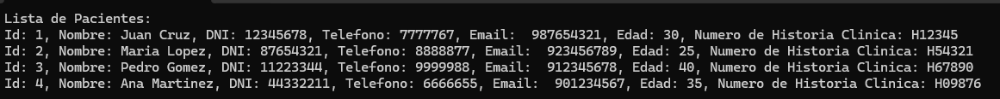
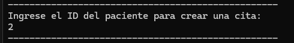
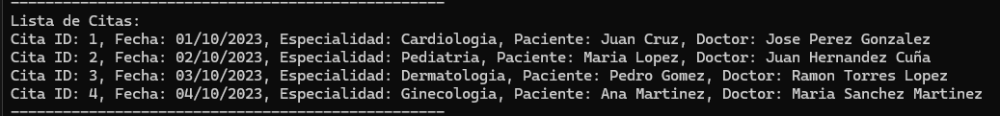
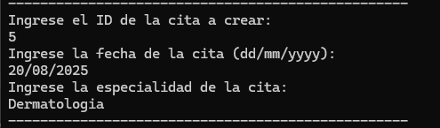
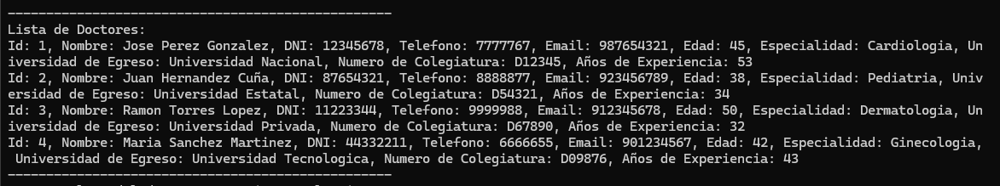
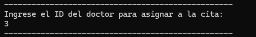
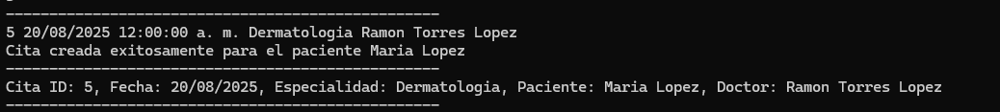
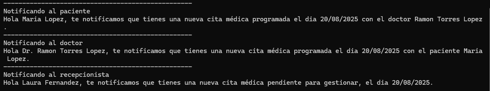

# 🏥 Sistema de Gestión de Citas Médicas en C#

### 👨‍⚕️ Funcionalidad del Programa

1. Muestra una lista de pacientes.
2. Solicita el ID del paciente para crear una cita.
3. Muestra la lista de citas existentes.
4. Solicita:
   - El ID de la nueva cita.
   - La fecha de la cita (formato `dd/mm/yyyy`).
   - La especialidad médica.
5. Muestra la lista de doctores disponibles.
6. Solicita el ID del doctor.
7. Crea una nueva cita médica.
8. Asigna la cita al paciente y al doctor.
9. Notifica:
   - Al paciente.
   - Al doctor.
   - A un recepcionista.

---

### 🧪 Datos Precargados

- 4 **Pacientes**
- 4 **Doctores**
- 4 **Recepcionistas**
- 4 **Citas Médicas**
- 4 **Hospitales**

---

### 🧱 Clases del Sistema

- `User`  
  Clase base para usuarios del sistema.

- `Patient`  
  Hereda de `User`. Tiene historial clínico y citas médicas.

- `Doctor`  
  Hereda de `User`. Tiene especialidad, universidad, colegiatura y años de experiencia.

- `Recepcionist`  
  Hereda de `User`. Tiene horario y área de trabajo.

- `MedicalAppointment`  
  Representa una cita médica entre paciente y doctor.

- `Hospital`  
  Contiene datos generales del hospital.

- `Program`  
  Contiene el método `Main` que gestiona toda la lógica de ejecución.

---

### 📞 Notificaciones Automáticas

Cada vez que se crea una cita médica, el sistema notifica automáticamente a:

- ✅ **Paciente** → Fecha, doctor asignado.
- ✅ **Doctor** → Fecha, paciente asignado.
- ✅ **Recepcionista** → Fecha de la cita para gestión.

---

###💡 Proceso de Creación de Cita Médica

1. **Se muestra la lista de pacientes.**  
   

2. **El usuario elige un paciente por ID.**  
   

3. **Se muestra la lista de citas existentes.**  
   

4. **El usuario ingresa los datos de la nueva cita.**  
   

5. **Se muestra la lista de doctores.**  
   

6. **El usuario selecciona un doctor por ID.**  
   

7. **Se crea la cita y se asigna.**  
   

8. **Se notifica al paciente, doctor y recepcionista.**  
   
